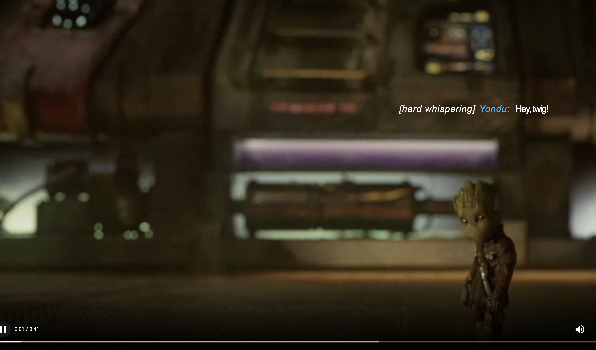

# Human Centered Design 

# 🌐 Live Demo
Je kan de laatste versie van mijn prototype [hier](https://kiara1404.github.io/human-centered-design-2122/prototype2.html) bekijken. BELANGRIJK, kijk op full screen mode!

# 🗂De opdracht
Ik heb de opdracht gekregen om een oplossing te maken voor één persoon. Het ontwerp dat ik maak kan drie keer getest worden. Het is dan ook de bedoeling dat ik door middel van het testen tot betere inzichten kom en zo een beter ontwerp kan maken voor Marie.

# 🧏🏼‍♀️ Het probleem
Marie is Doof (met een hoofdletter inderdaad, dat betekent dat ze zichzelf als Doof identificeert, wat simpelgezegd betekent dat haar eerste taal Nederlandse Gebarentaal is). Je zult begrijpen dat Marie moeite heeft met dingen waar geluid een grote rol speelt.

Voor Marie gaat er enorm veel nuance verloren tijdens het kijken naar een film of een documentaire. Bij veel films worden closed captions aangeboden, maar die zijn zo neutraal als maar kan. Hoe zou je closed captions op een goede manier kunnen weergeven zodat zij dezelfde film of documentaire ziet als horende mensen?

# De oplossing
Ik heb geprobeerd om een prototype te maken met geheel zelfgemaakte captions omdat de huidige oplossingen niet genoeg zijn.
In mijn ontwerp heb ik alle feedback van Marie zo goed mogelijk geprobeerd toe te passen. Belangrijkste punten hierbij zijn:
* Spelen met typografie. Het aanpassen van letterspacing, font-size en witruimte kwam ik al heel ver.
* Beschrijf alleen geluid met hoe het klinkt als je het kan zien.
* Beschrijf uitgebreider wanneer iets buiten het scherm gebeurd.

Voor meer informatie over mijn oplossing wil ik je graag verwijzen naar mijn ]wiki page](https://github.com/kiara1404/human-centered-design-2122/wiki). Daar staat alles uitgebreid beschreven

# License

